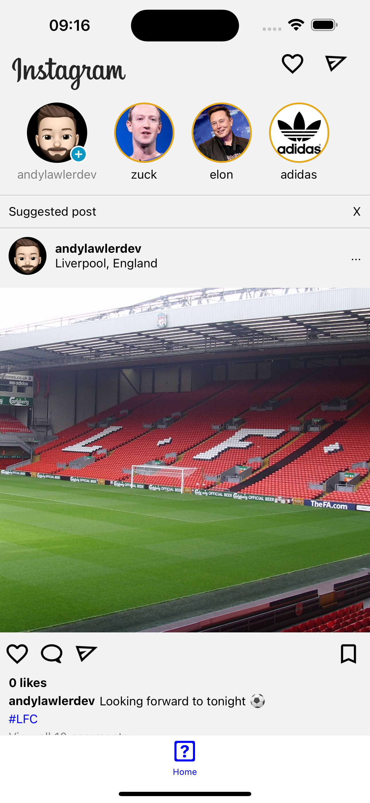
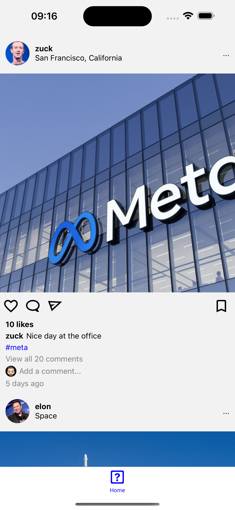

# Instagram Clone

Instagram Clone app built using React Native. This app was built to learn and explore more about React Native. The app uses React + React Native/Typescript and also Redux to manage state.

# Getting started

- `npm install` in the root directory.
- `bundle install` in the ios directory.
- `bundle exec pod install` in the ios directory.
- `npm run ios` OR `npm run android` in the root directory.

## How it looks

